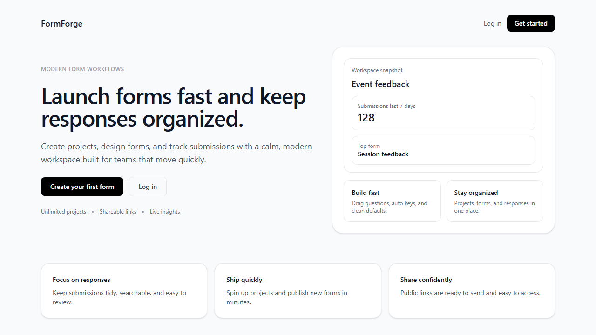
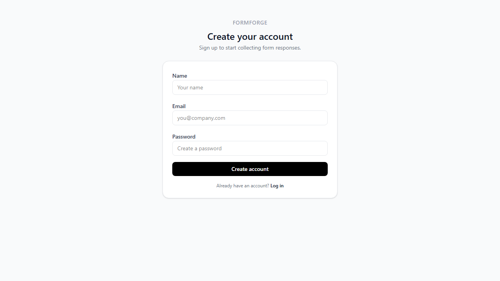
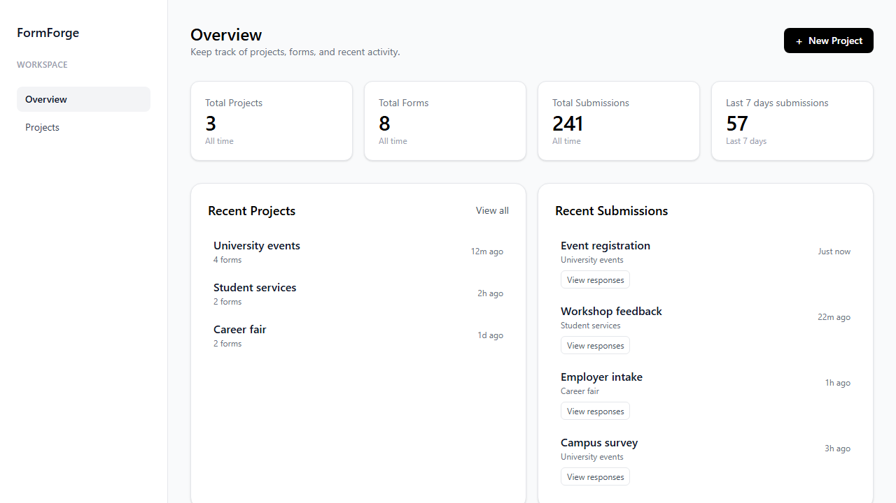
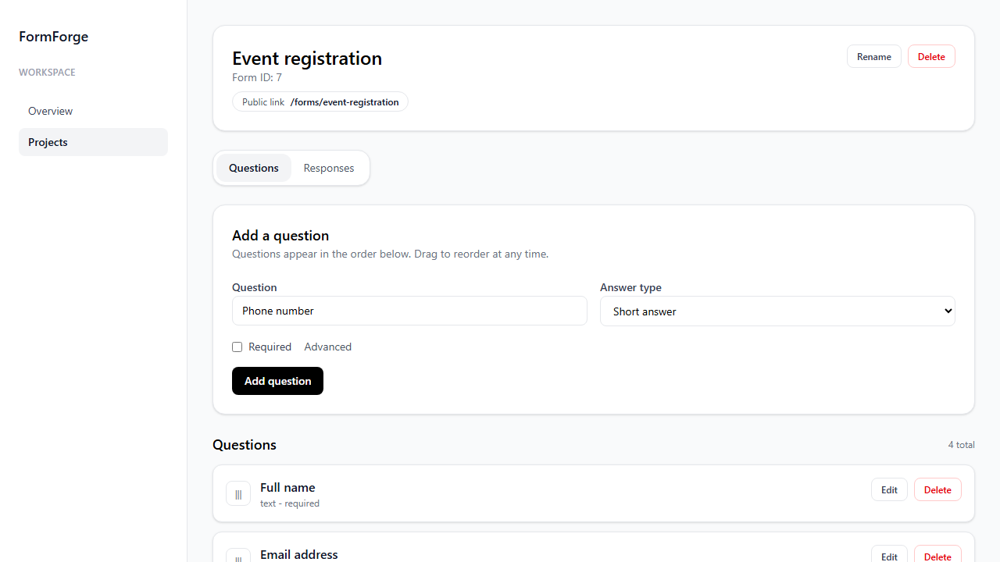
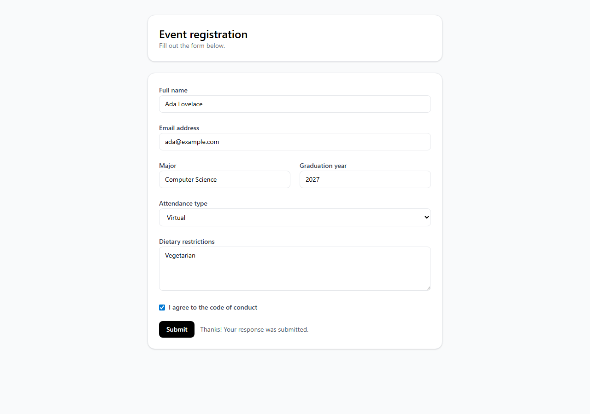

# FormForge

FormForge is a Next.js app for building forms, collecting submissions, and managing projects in a clean, modern dashboard.

Live URL: https://form-forge-self.vercel.app/

## Screenshots











## Features

- Projects and forms management
- Public form pages with shareable links
- Public submission API for programmatic form responses
- Submissions tracking and response insights
- Drag-and-drop field ordering
- Dashboard analytics for totals and recent activity
- Supabase authentication

## Tech Stack

- Next.js App Router
- React
- Tailwind CSS
- Prisma + PostgreSQL
- Supabase Auth
- Zod validation

## Routes

- `/` - Marketing landing page
- `/auth/login` - Log in
- `/auth/signup` - Sign up
- `/dashboard` - Overview dashboard
- `/projects` - Projects list
- `/projects/[projectId]` - Project detail
- `/projects/[projectId]/forms/[formId]` - Form builder, insights, and responses
- `/forms/[slug]` - Public form

## Database Schema

FormForge uses a small relational schema for ownership and form structure, with JSON fields for flexible response data.

| Model | Purpose | Key fields |
| --- | --- | --- |
| `Project` | Groups forms under one authenticated owner. | `ownerId`, `name`, `createdAt`, `updatedAt` |
| `Form` | Stores the form shell and public URL identity. | `projectId`, `name`, `slug`, `status` |
| `Field` | Defines each question in a form. | `formId`, `key`, `label`, `type`, `required`, `orderIndex`, `options`, `config` |
| `Submission` | Stores one completed response. | `formId`, `answersJson`, `metadataJson`, `submittedAt` |

Relationships:

- A `Project` has many `Form` records.
- A `Form` belongs to one `Project`, has many `Field` records, and has many `Submission` records.
- `Field` records are unique by `formId + key`, so each form can safely map answers by field key.
- `Submission.answersJson` stores the submitted values keyed by `Field.key`.
- `Submission.metadataJson` stores optional request or integration context, such as source, campaign, or user-agent data.
- Deleting a form cascades to its fields and submissions.

Indexes:

- `Form.projectId` supports project detail pages.
- `Form.slug` is unique for public form URLs and API submission lookup.
- `Field.formId` supports ordered form rendering.
- `Submission.formId` and `Submission.submittedAt` support recent-response dashboards and analytics.

## Submission API

FormForge includes a public-by-slug submission endpoint used by the public form page and by external clients.

### Create a submission

`POST /api/forms/slug/[slug]/submit`

Request body:

```json
{
  "answersJson": {
    "full_name": "Ada Lovelace",
    "email": "ada@example.com",
    "attendance_type": "virtual"
  },
  "metadataJson": {
    "source": "website",
    "campaign": "spring-launch"
  },
  "honeypot": "",
  "startedAt": 1765827000000
}
```

Required fields:

- `answersJson` - Object keyed by the form field keys.

Optional fields:

- `metadataJson` - Object for integration metadata.
- `honeypot` - Empty string used by the browser form to reject bot traffic.
- `startedAt` - Client-side timestamp used to reject unrealistically fast submissions.

Successful response:

```json
{
  "submission": {
    "id": 42,
    "formId": 7,
    "answersJson": {
      "full_name": "Ada Lovelace",
      "email": "ada@example.com",
      "attendance_type": "virtual"
    },
    "metadataJson": {
      "source": "website",
      "campaign": "spring-launch"
    },
    "submittedAt": "2026-06-15T18:30:00.000Z"
  }
}
```

Example:

```bash
curl -X POST "https://form-forge-self.vercel.app/api/forms/slug/my-form/submit" \
  -H "Content-Type: application/json" \
  -d '{
    "answersJson": {
      "full_name": "Ada Lovelace",
      "email": "ada@example.com"
    },
    "metadataJson": {
      "source": "api"
    }
  }'
```

Error responses:

- `400` - Invalid request body or spam check failed.
- `404` - No form exists for the provided slug.
- `500` - Submission could not be saved.

### Read submissions

`GET /api/forms/[formId]/submissions`

This endpoint is owner-only. It requires a valid Supabase session, checks that the form belongs to the authenticated user, and returns the latest 50 submissions in descending `submittedAt` order.

### API design notes

- The public submission API intentionally identifies forms by slug so clients do not need internal numeric IDs.
- Ownership checks are kept on dashboard and reporting routes, while the public submit route stays unauthenticated for shareable forms.
- The current API validates request shape with Zod and stores dynamic answers as JSONB.
- Future hardening should include per-form required-field validation, form-status checks for draft/closed forms, rate limiting, and optional API keys for server-to-server integrations.

## Technical Challenges

- Dynamic form shape: Forms can have different fields, types, options, and ordering, so responses are stored as JSONB keyed by stable field keys instead of forcing every answer into a fixed table.
- Public submissions with private dashboards: Public form pages must accept anonymous responses, while project, form, and response management routes must re-check Supabase ownership on the server.
- Response insights over flexible data: The dashboard computes summaries from JSON answers, including select-option counts, checkbox breakdowns, numeric averages, and recent submissions.
- Spam reduction without account friction: The public form submission path uses a honeypot field and minimum elapsed-time check without requiring respondents to log in.
- Server-rendered data boundaries: App Router server components fetch project/form data directly with Prisma, while client components handle interactive form builders and submissions.

## Getting Started

1. Install dependencies:

```bash
npm install
```

2. Create a `.env` file with:

```env
NEXT_PUBLIC_SUPABASE_URL=
NEXT_PUBLIC_SUPABASE_ANON_KEY=
DATABASE_URL=
```

3. Generate the Prisma client:

```bash
npx prisma generate
```

4. Run the dev server:

```bash
npm run dev
```

5. Open `http://localhost:3000`.

## Scripts

- `npm run dev` - Start the development server
- `npm run build` - Build for production
- `npm run start` - Start the production server
- `npm run lint` - Lint the codebase
